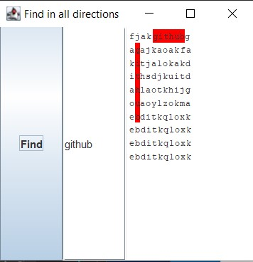

# findWord
In some crossword magazines you can find crosswords, where you must mark all of the given words or numbers and then write down the password (the remaining characters).
With this program you can speed up this process.

Program is written in java using IntelliJ IDEA 14.1.4.

This is just a simple program, where you enter the characters (e.g. from crossword magazine) and then enter the word you are searching. Program will look up in every direction if the word exists and mark it red.
When you gain focus, all red colors are removed.



Tested working in java 11.

```
javac .\FindInAllDirections.java
java FindInAllDirections
```